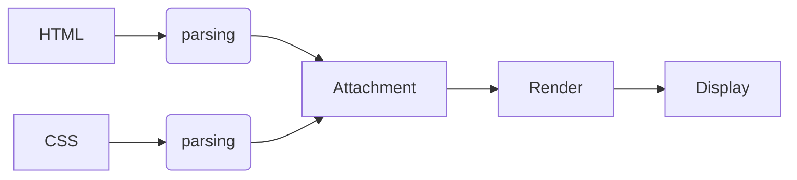

Explain the rendering of websites in the browser using a complete
block diagram. Every block should be explained in your own
words.List down all the names of JS engines and their creators.

HTML and Css are parsed on the server to an attachment.Then this attachment in rendered along with the layout and thus we get thee display

*HTML*
Hypertext Markup language is an absolute necessity in any kind of page to be viewed on the browser.
It is
*CSS*

*ATTACHMENT*

*RENDER*

*DISPLAY*

_________________________
Js Engines and Creators
1)The first JavaScript engine was created by Brendan Eich in 1995 for the Netscape Navigator web browser.
1)V8 Engine from Google
2) Apple developed the Nitro engine for its Safari browser now callec JavaScriptCore.